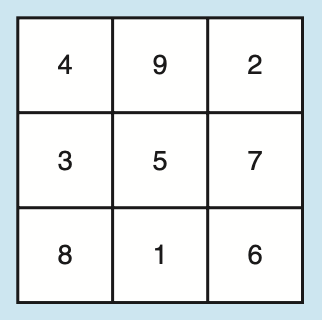
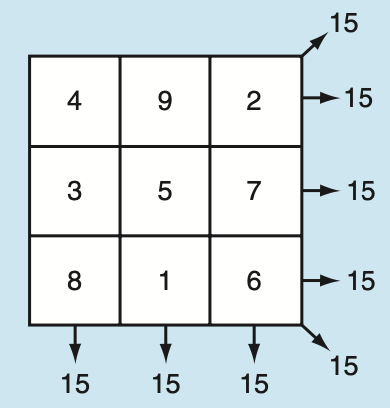

[github link](https://github.com/CCOM3033-002/lab10-desteny-hernandez)
# Lo Shu Magic Square 

Este laboratorio tiene un valor de 15 puntos. La fecha de entrega está en moodle. Entregas tardías perderán 1 punto por cada día o fracción de día que se entrege tarde.  

### Antes de comenzar

El **Lo Shu Magic Square** es una cuadrícula con 3 filas y 3 columnas mostrada en la primera Figura abajo. El Lo Shu Magic Square tiene las siguientes propidedades:

- La cuadrícula contiene los números del 1 al 9 exactamente (sin repeticiones).
- La suma de cada fila, cada columna y cada diagonal suman el mismo número. Esto se muestra en la segunda Figura abajo.

En un programa puedes simular un cuadrado mágico usando un arreglo en 2D.

### Instrucciones

- Escribe una función booleana llamada `isMagicSquare` que acepte un arreglo en 2D como argumento y determine si el arreglo es un Lo Shu Magic Square.
- En `main`, pídale al usuario que ingrese los elementos del arreglo por fila.
- Usa la función `isMagicSquare` para detectar si las entradas del usuario forman un Lo Shu Magic Square.
- El programa luego debe mostrar un mensaje diciendo si el usuario ingresó un Lo Shu Magic Square o no.

Comentarios:

- Usa una constante global llamda `COLS` para la cantidad de columnas.
- Usa una constante local a `main` para la cantidad de filas.
- El programa solo debe usar arreglos, **NO** vectores.
- El programa debe implementar descomposición de funciones para tareas más pequeñas requeridas para crear la función `isMagicSquare`.
- Puede reusar las funciónes `getRowTotal` y `getColumnTotal` del laboratorio 4 (el único copy paste permitido es este).

### Rúbrica

Su programa debe:

- - Seguir las instrucciones detalladas arriba (11 pts):
  - Implementar descomposición de funciones para los componentes de la función `isMagicSquare` (5 pts)
  - Definir e utilizar correctamente la función `isMagicSquare` (4 pts)
  - Pedirle el input al usuario con un prompt adecuado y procesar el input debidamente (1 pt)
  - Definir las constantes especificadas arriba (1 pt)
  - **NO** se pueden utilizar vectores, de hacerlo perderá 1/4 de los puntos. 
- Tener nombres apropiados para las variables y funciones (1 pt)
- Tener una indentación apropiada y consistente que facilite la legibilidad de su código (1 pt)
- Debe estar debidamente comentado de manera que su código sea entendible (1 pt)
  - Brinde explicaciones donde el proceso no sea obvio, incluya su razonamiento de por qué su implementación funciona.
- Debe contener un *header* con su información y colaboraciones en un comentario (1 pt)
  - No es recomendado el uso de LLM para ningun trabajo, pero de utilizarlo debe incluir en el *header* un link a la conversación completa con los prompts hechos y las contestaciones brindadas por el LLM. De no hacerlo, si se detecta que su código fue copiado de un LLM, recibirá 0 en su trabajo.
- Si su programa no corre o se interrumpe, perderá la mitad de los puntos
- Utilizar **solamente** los conceptos discutidos en clase, de incluir conceptos o estructuras no establecidas en clase, perderán 1/3 de los puntos
